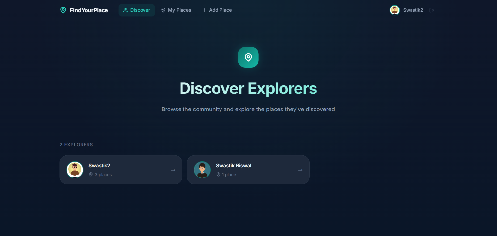
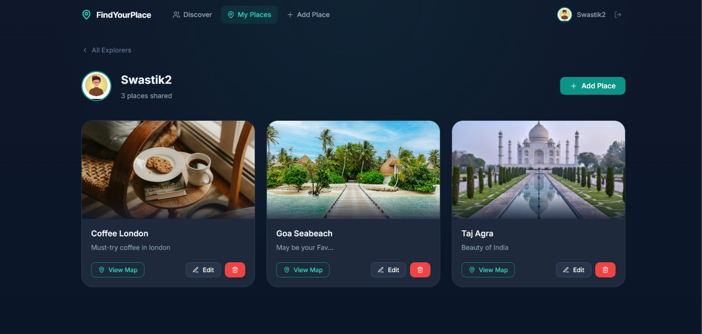
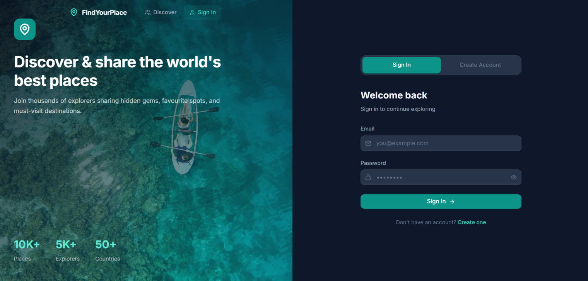

<h1 align="center">📍 FindYourPlace</h1>

<p align="center">
Discover, save, and share your favourite places with a modern full-stack travel platform.
</p>

<p align="center">


</p>

---

# 🚀 Live Demo

### 🌐 https://place-explorerr.vercel.app/

---

# 📖 About

**FindYourPlace** is a modern full-stack travel discovery platform that enables users to discover new destinations, save their favourite places, and share memorable travel experiences with the community.

The application is built using **React**, **TypeScript**, **Tailwind CSS**, and **Supabase**, providing a clean architecture, responsive interface, secure authentication, and a smooth user experience.

> **Note:** The map feature is currently a demo preview for enhancing the user experience and does not provide real-time navigation.

---

# ✨ Features

- 🔐 Secure Authentication
- 👤 User Profiles
- 🌍 Discover Community Explorers
- ❤️ Save Favourite Places
- ➕ Add New Places
- ✏️ Edit Existing Places
- 🗑 Delete Places
- 📱 Fully Responsive Design
- 🎨 Modern Dark UI
- ⚡ Fast Performance with Vite
- ☁️ Supabase Backend Integration
- 🗺 Demo Map Preview
- 🔥 TypeScript Support

---

# 📸 Screenshots

## 🏠 Home (Discover)



---

## 📍 My Places



---

## 🔐 Authentication



---

# 🛠 Tech Stack

## Frontend

- React
- TypeScript
- Vite
- Tailwind CSS
- Framer Motion
- React Router DOM

## Backend

- Supabase
- PostgreSQL

## Maps

- React Leaflet
- Leaflet (Demo Preview)

---

# 📂 Folder Structure

```text
src
│
├── components
├── context
├── lib
├── pages
│
├── App.tsx
├── main.tsx
└── index.css

supabase
│
└── migrations
```

---

# ⚙️ Installation

Clone the repository

```bash
git clone https://github.com/Swastik99-git/place-explorerr.git
```

Go to the project directory

```bash
cd place-explorerr
```

Install dependencies

```bash
npm install
```

Create a `.env` file

```env
VITE_SUPABASE_URL=YOUR_SUPABASE_URL
VITE_SUPABASE_ANON_KEY=YOUR_SUPABASE_ANON_KEY
```

Run the development server

```bash
npm run dev
```

---

# 🏗 Build for Production

```bash
npm run build
```

Preview the production build

```bash
npm run preview
```

---

# 🚀 Future Improvements

- 🌍 Real-time Interactive Maps
- 🤖 AI Travel Recommendations
- ❤️ Wishlist
- ⭐ Ratings & Reviews
- 🌦 Weather Information
- 📅 Trip Planner
- 🔍 Advanced Search & Filters
- 📸 Multiple Image Upload Support
- 💬 Comments & Community Features

---

# 👨‍💻 Developer

### Swastik Biswal

- GitHub: https://github.com/Swastik99-git
- Portfolio: *(Coming Soon)*

---

# ⭐ Support

If you enjoyed this project, consider giving it a ⭐ on GitHub. Your support helps motivate future improvements!
